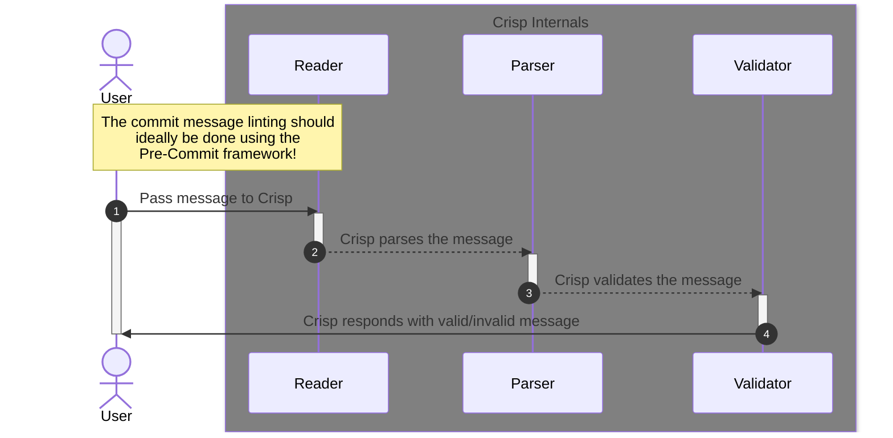

The internal logic that powers Crisp are divided into three distinct individual
parts:

1. The **reader** which is responsible for reading the Git commit message either
   from STDIN (piped in) or from the `$GIT_DIR/COMMIT_EDITMSG` file (see the
   [official Git docs](https://git-scm.com/docs/git-commit/2.2.3#Documentation/git-commit.txt-codeGITDIRCOMMITEDITMSGcode)).

2. The `parser` which is responsible for accepting the inputted commit message
   and then parsing it into a Go struct for further data processing.

3. The `validator` which is responsible for running some validation logic on the
   parsed data.

Under the hood, all three of the aforementioned components work in tandem to
lint your Git commit messages. The following diagram will provide a better
understanding of the underlying logic of the software.

