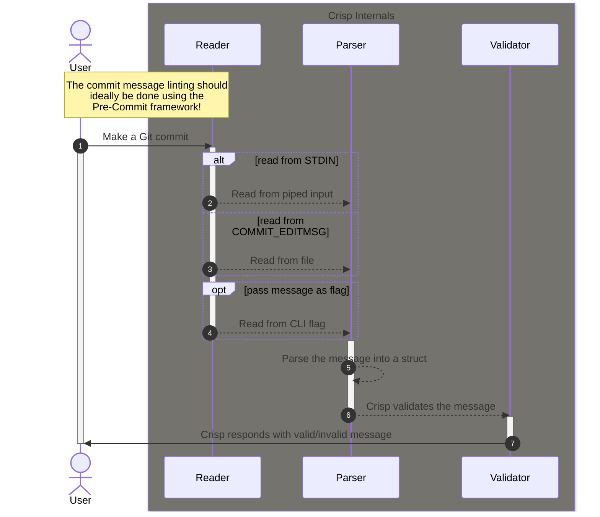
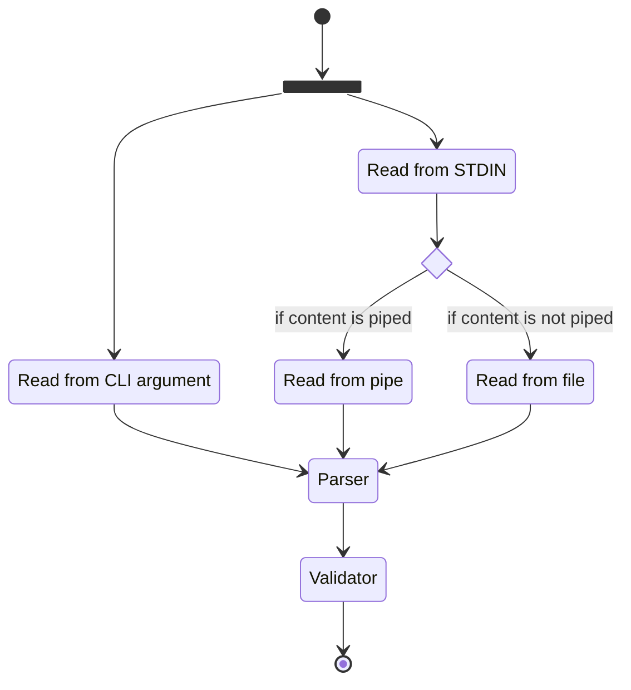

The internal logic that powers Crisp are divided into three distinct individual
parts:

1. The **reader** which is responsible for reading the Git commit message either
   from STDIN (piped in) or from the `$GIT_DIR/COMMIT_EDITMSG` file (see the
   [official Git docs](https://git-scm.com/docs/git-commit/2.2.3#Documentation/git-commit.txt-codeGITDIRCOMMITEDITMSGcode)).

2. The `parser` which is responsible for accepting the inputted commit message
   and then parsing it into a Go struct for further data processing.

3. The `validator` which is responsible for running some validation logic on the
   parsed data.

Under the hood, all three of the aforementioned components work in tandem to
lint your Git commit messages. The following diagram will provide a better
understanding of the underlying logic of the software.



## Reader

The reader is responsible for accepting user input through either of the
following means:

1. Directly passed as a CLI flag,
2. Read from STDIN where the data is piped into it.
3. Read the `$GIT_DIR/COMMIT_EDITMSG` file.

In other words, Crisp can read a commit message if it is directly passed to it
as a argument of the `message` command as shown below;

```console
crisp message "$(git show --no-patch --format=%B)"
```

While that is not the recommended approach to lint a commit message, it exists
for quickly validating a single message. The recommended approach to lint a
commit message is to pass the data to Crisp through `STDIN`. Crisp will read
from `STDIN` if the `--stdin` flag is passed to the `message` command.

So, piping a commit message to Crisp is possible like this;

```console
git show --no-patch --format=%B | crisp message --stdin
```

In case no commit message was piped in to Crisp, the reader will fallback to
reading from the
[`$GIT_DIR/COMMIT_EDITMSG`](https://git-scm.com/docs/git-commit#Documentation/git-commit.txt-codeGITDIRCOMMITEDITMSGcode)
file.

The diagram below will provide a better understanding of how the reader works
behind-the-scenes.



## Parser

<!--prettier-ignore-start-->
:::caution
The parser is still heavily a work-in-progress (WIP) and hence information regarding it
is temporarily unavailable.
:::
<!--prettier-ignore-end-->

The parser is responsible for receiving content from the reader and parsing it
into the following components;

1. **Header**
2. **Body**
3. **Footer**

Upon successful parsing operation, the logic generates and returns a Go struct
for further processing and data validation.

## Validator

After Crisp has parsed and generated a "commit message" object, the validator
can receive the said object for further processing and validation. The validator
performs the following operations:

1. Checks whether the commit type is in accordance to the list of accepted
   keywords (`build`, `ci`, `docs`, `feat`, `fix`, `perf`, `refactor`, `style`,
   `test`, `chore`).

2. If the optional commit message scope is provided, check whether it is
   lower-cased and contains valid characters.

3. Checks whether the commit message subject is provided and does not end with a
   period (`.`) nor starts with a capitalised letter.

4. Checks whether the length of the commit message does not exceed more than 50
   characters long.

<!--prettier-ignore-start-->
:::note
A future update will enable the functionality to provide a user-defined list of
accepted keywords, for now they are hardcoded and based on the commit messages
standards used by the Angular project ([see the docs](https://github.com/angular/angular/blob/22b96b9/CONTRIBUTING.md#type)).
Along with the ability to configure the list of accept commit types, users will also
be able to define the allowed length of the commit message.
:::
<!--prettier-ignore-end-->

On successful validation, Crisp returns an appropriate `valid commit message`
prompt for the user with an exit status code of `0`.
